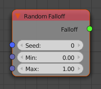
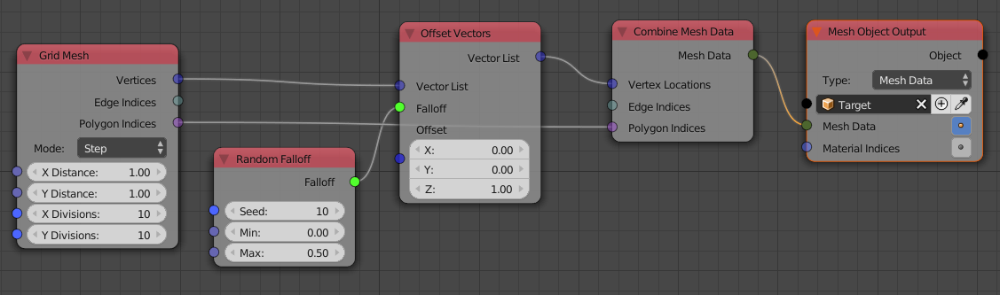

Random Falloff
==============

The created falloff calculates a random influence for every object.

Inputs
------

- **Seed** - Change this to get a different set of random numbers.
- **Min** - Lower bound for the random numbers.
- **Max** - Upper bound for the random numbers.

Outputs
-------

- **Falloff** - The actual falloff object.

Advanced Node Settings
----------------------

- N/A

Examples of Usage
-----------------

Create a grid mesh where each vertex is moved up by a random amount:

