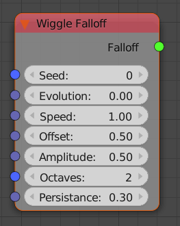

Wiggle Falloff
==============

Similar to the **Random Falloff** node but the random values in this node can be animated.

Inputs
------

The inputs are very similar to the inputs of the :ref:`number-wiggle` node.

Outputs
-------

- **Falloff** - The actual falloff object.

Examples of Usage
-----------------

.. image:: gifs/wiggle_falloff_example.gif
