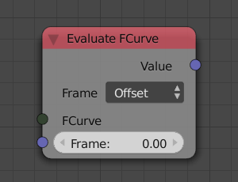
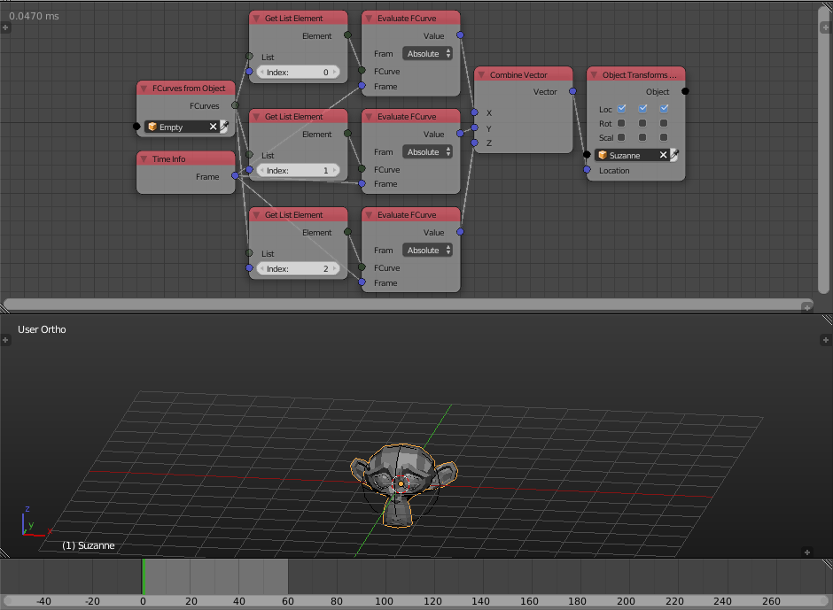

Evaluate FCurve
===============

Description
-----------
This node evaluates a fcurve at a specific frame.

For a fcurve that correspond to the x location of an object, evaluating the fcurve at a frame will return the x location of the object at that frame.

The input frame can be relative(**offset**) to the current frame or **absolute** and you can set it from the node option.

Inputs
------

- **FCurve** - An fcurve to evaluate.
- **Frame** - The frame at which the fcurve is evaluated.

Outputs
-------

- **Value** - The value of fcurve at the input frame.

Advanced Node Settings
----------------------

- N/A

Examples of Usage
-----------------

