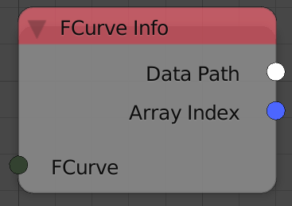

FCurve Info
===========

Description
-----------
This node returns some inormation about the input fcurve.

Inputs
------

- **FCurve** - An input fcurve.

Outputs
-------

- **Data Path** - A string that contain the RNA data path for the animated property(For instance, if the location of an object was the animated property then its data path will be:location)
- **Array Index** - An integer that contain the index of the animated property. Multidimensional property like location,rotation and scale---XYZ---have an index for each channel, that is, x is `0`,y is `1`,z is `2`.Properties that are one dimensional will just return `0`.

Advanced Node Settings
----------------------

- N/A

Examples of Usage
-----------------

.. image:: gifs/fcurve_info_node_example.gif
