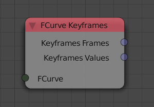
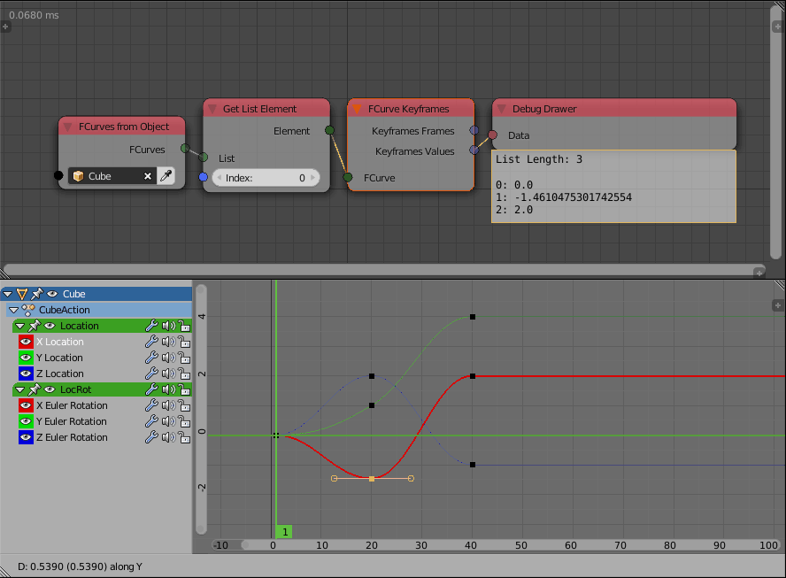

FCurve Keyframes
================

Description
-----------
This node return the location and the value of the keyframes that composed the FCurve.

For instance, If one were to animate the x location of an object he would insert a keyframe at the frame `0` when the object location was `0` and another keyframe at the frame `20` when the location of the object was `5`. An fcurve would be created as a result of this animation and this node will return 2 lists, **KeyFrames Frames** which will contain `[0,20]` which is the location of our frames and **KeyFrames Values** which will contain `[0,5]` which is the x locations of our frames.

Inputs
------

- **FCurve** - An input fcurve.

Outputs
-------

- **Keyframes Frames** - A float list that contain the locations of the frames that composed the input fcurve.
- **Keyframes Values** - A float list that contain the values of the frames that composed the input fcurve.

Advanced Node Settings
----------------------

- N/A

Examples of Usage
-----------------

