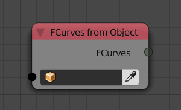
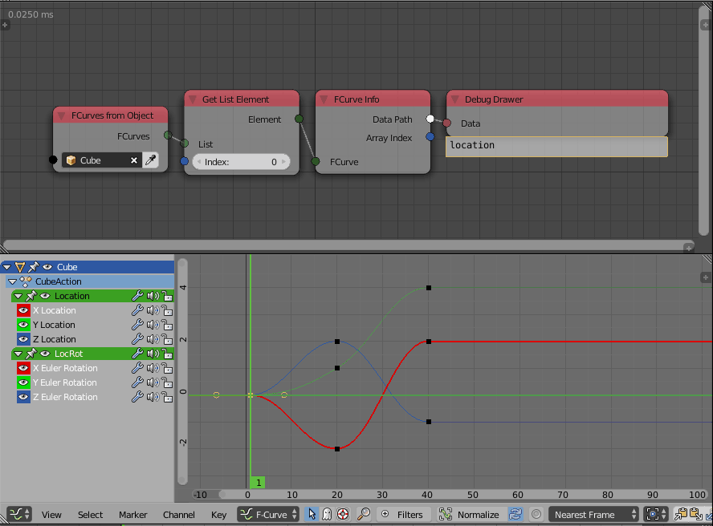

FCurves From Object
===================

Description
-----------
This node returns a list of all FCurves in the input object.

FCurve is a blender data block which store the animation keyframes interpolation of the animated property. A FCurve carry the animation information of only a single value which means, if the xyz locations of an object were animated, three fcurves will be generated---One for each transformation channel.

Inputs
------

- **Object** - An object to return its fcurves.

Outputs
-------

- **FCurves** - A list of all fcurves in the input object.

Advanced Node Settings
----------------------

- N/A

Examples of Usage
-----------------

