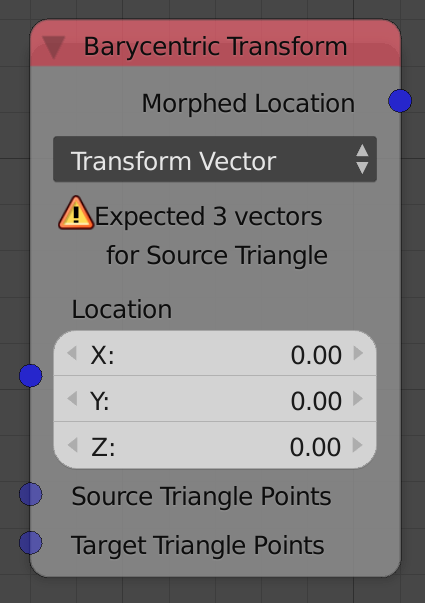
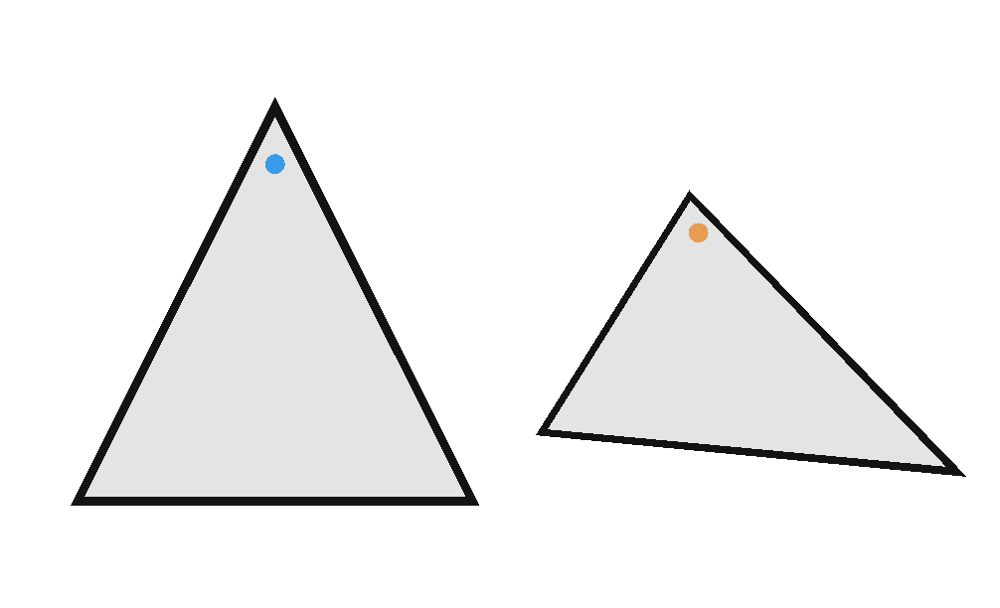
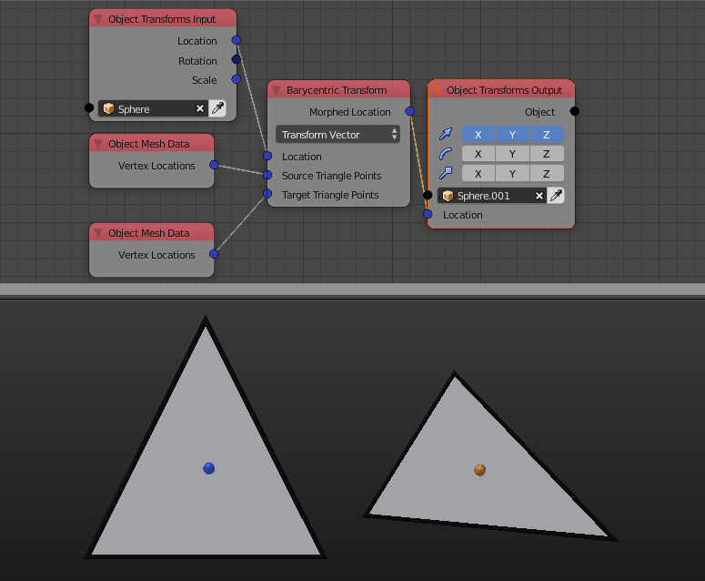

Barycentric Transform
=====================

Description
-----------

This node perform a barycentric transformation from a triangle to another.

Demonstration
-------------

Any point that lies on a triangle can be described in terms of the vertices of that triangle using what is known as a convex combination. A convex combination is a linear combination of points (vectors) where all coefficients are non-negative and sum to 1. If the point is close to one of the vertices of the triangle, then its coefficient will be the largest.

The barycentric transform node compute the coefficients of the convex combination that describe the input point in the input source triangle, then it uses those coefficients to compute the location of the point that lie on the input target triangle through a convex combination of its vertices, see the below illustration if you didn't get it.

Inputs
------

- **Location** - The location of the point that lies on the source triangle.
- **Source Triangle Points** - The location of the vertices of the triangle used to compute the coefficients of the convex combination from.
- **Target Triangle Points** - The location of the vertices of the triangle to apply the convex combination to.

Outputs
-------

- **Morphed Location** - The location of the point resulted from the convex combination.

Advanced Node Settings
----------------------

- N/A

Examples of Usage
-----------------

