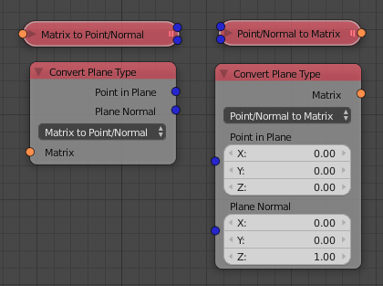

Convert Plane Type
==================

Some nodes need a plane as input. A plane can be exactly defined in multiple ways.
This node makes the conversion between these types easy.

Modes:

- Point/Normal to Matrix
- Matrix to Point/Normal
