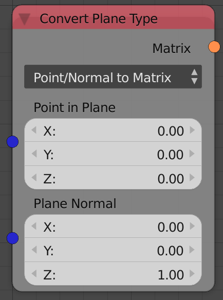
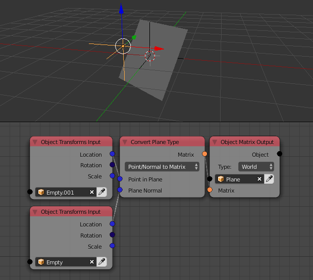

Convert Plane Type
==================

Description
-----------
This node converts between the two representations of 3d planes---Point/Normal and Transformation Matrix.

Not to be mistaken by the primitive plane, Planes here are mathematical objects that can be defined by a normal and a location or a transformation matrix since matrices can encode both the normal and the location of the plane.

Options
-------

- **Point/Normal To Matrix** - This option will encode the input location and the input normal of the plane into a transformation matrix.

- **Matrix To Point/Normal** - This option will decode the input transformation matrix and return the location and the normal of the plane represented by that transformation matrix.

Inputs
------

- **Point In Plane** - A vector that correspond to the location of a point in the plane.(Only in the Point/Normal To Matrix option)
- **Plane Normal** - A unit vector that correspond to the normal of the plane.(Only in the Point/Normal To Matrix option)
- **Matrix** - A transformation matrix that represent the plane.(Only in the Matrix To Point/Normal option)

Outputs
-------

- **Point In Plane** - A vector that correspond to the location of a point in the plane.(Only in the Point/Normal To Matrix option)
- **Plane Normal** - A unit vector that correspond to the normal of the plane.(Only in the Point/Normal To Matrix option)
- **Matrix** - A transformation matrix that represent the plane.(Only in the Matrix To Point/Normal option)

Advanced Node Settings
----------------------

- N/A

Examples of Usage
-----------------

