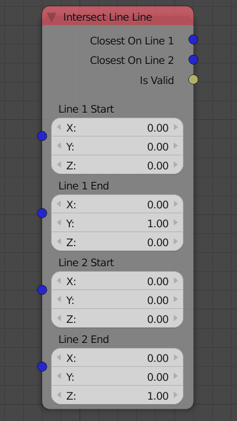
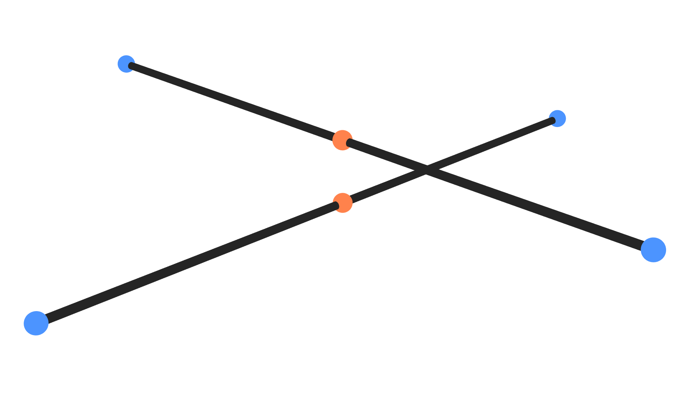

Intersect Line Line
===================

Description
-----------
This node takes 2 lines and returns the locations of 2 points (one on each of them) that are closest to each other.

Illustration
------------

Blue points are the input points and orange points are the output points. Orange points are the closest points on the lines.

Inputs
------

- **Line 1 Start** - The location of the starting point of the first line.
- **Line 1 End** - The location of the ending point of the first line.
- **Line 2 Start** - The location of the starting point of the second line.
- **Line 2 End** - The location of the ending point of the second line.

Outputs
-------

- **Closest On Line 1** - The location of the closest point on line 1.
- **Closest On Line 2** - The location of the closest point on line 2.
- **Is Valid** - A boolean which is True if a closest pair was found and False if not. Closest pair won't be found only if both lines were parallel.

Advanced Node Settings
----------------------

- N/A
