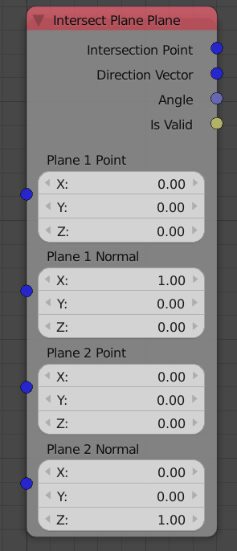
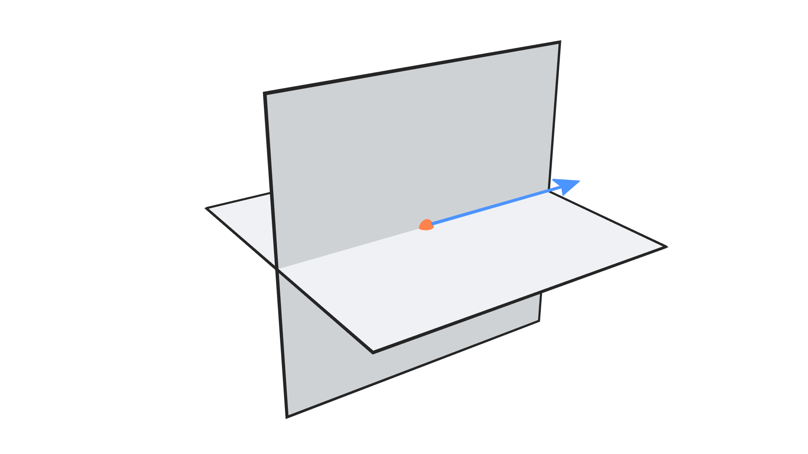

Intersect Plane Plane
=====================

Description
-----------

This node returns some information about the intersection of input planes.

Illustration
------------

Orange point is the intersection point and blue vector is the direction vector.

Demonstration
-------------

If you are familiar with the basics of solid geometry, you would know that a plane intersect another plane in a straight line and not in a point.
There is multiple ways to represent a straight line, the node uses the way of representing it using a point and a unit vector to define its direction. This point could have been in any location along the line, but the node tries to minimize the distance to the origin as much as possible, so it chooses the point along the line that is closest to the origin point.

Inputs
------

- **Plane 1 Point** - A point on the first required plane.
- **Plane 1 Normal** - A unit vector that represent the normal of the  first required plane.
- **Plane 2 Point** - A point on the second required plane.
- **Plane 2 Normal** - A unit vector that represent the normal of the second required plane.

Outputs
-------

- **Intersection Point** - The location of the closest point to the world center that is on the line of intersection of the planes.
- **Direction Vector** - A unit vector that describe the direction of the line of intersection of the two planes.
- **Angle** - The angle between input planes in radians.
- **Is Valid** - A boolean which is True if an intersection was found and False otherwise. If it is False, that means that the planes are parallel or identical.

Advanced Node Settings
----------------------

- N/A
