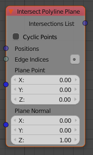

Intersect Polyline Plane
========================

This is a special case of Line Plane intersections that has many applications, for polygons, splines or objects.

The node takes a vector list. By default the order in which the vectors are in the
list will determine the line segments. Optionally there is also an *Edge Indices*
input which (when enabled) determines the line segments.

In both cases there wil be returned (some outputs are hidden by default):
  - a list of vectors for intersection points
  - indices of edges that are cut so that u can use only those edges further
  - what side of the plane edges are on (1, -1 for above, below and 0 if cut) to help keep only part of the edges further
  - Is Valid, if any intersections at all

This helps "cut" a polyline or spline with a plane, but also to create lines or splines inside respective contour.
Also may use to make level curves or section contours out of objects.
