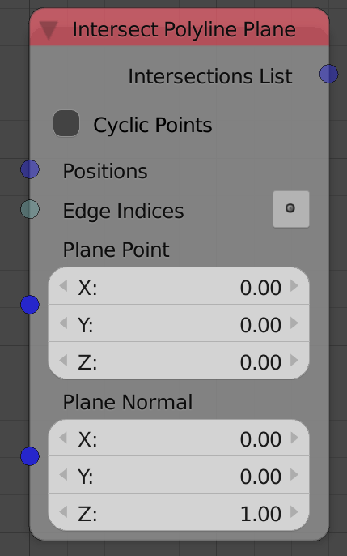
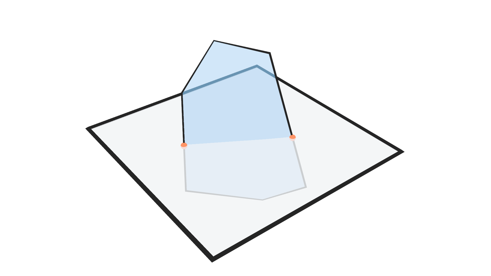

Intersect Polyline Plane
========================

Description
-----------
This node returns some information about the intersection of the input polygon with the input plane.

Illustration
------------

Orange points are the only intersections with the input plane.

Options
-------

- **Cyclic Points** - If enabled, the connection between the last and first point will be considered for possible intersections. If this connections is defined in the edge indices then there is no need to check this option.

Inputs
------

- **Positions** - The locations of the vertices of the polygon.
- **Edge Indices** - An edge indices list that describe the connections between polygon's vertices.
- **Plane Point** - A point on the required plane.
- **Plane Normal** - A unit vector that represent the normal of the required plane.

Outputs
-------

- **Intersection List** - A vector list the contain the locations of the points of intersection with the plane.
- **Intersected Edge Index** - An integer list that contains the indices of the edges that intersected with the plane.
- **Intersected Edge Plane Side** - `To Do`
- **Is Valid** - A boolean which is True if an intersection was found, and Fasle otherwise.

Advanced Node Settings
----------------------

- N/A
