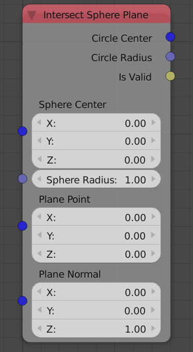

Intersect Sphere Plane
======================

Description
-----------
This node return some information about the intersection of input sphere and input plane.

Illustration
------------

.. image:: images/intersect_sphere_plane_node_illustration.png

Orange point is the center of the blue intersected circle.

Inputs
------

- **Sphere Center** - The location of the center of the required sphere.
- **Sphere Radius** - The radius length of the required sphere.
- **Plane Point** - A point on the required plane.
- **Plane Normal** - A unit vector that represent the normal of the required plane.

Outputs
-------

- **Circle Center** - The location of the center of the intersected circle.
- **Circle Radius** - The radius length of the intersected circle. if this values is zero and Is valid is True, that that means that the plane is tangent to the sphere at the Circle Center.
- **Is Valid** - A boolean which is True if an intersection was found, and False otherwise.

Advanced Node Settings
----------------------

- N/A
