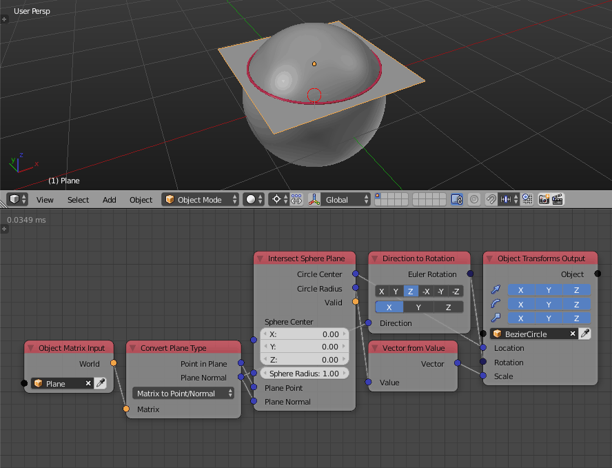

Intersect Sphere Plane
======================

Description
-----------

This node returns the intersection circle of input sphere and plane. A plane intersects a sphere in a circle, the node returns the radius and location of this circle.

.. image:: images/intersect_sphere_plane_node.png
   :width: 160pt

Illustration
------------

.. image:: images/intersect_sphere_plane_node_illustration.png

Orange point is the center of the blue intersected circle.

Inputs
------

- **Sphere Center** - The location of the center of the required sphere.
- **Sphere Radius** - The radius length of the required sphere.
- **Plane Point** - A point on the required plane.
- **Plane Normal** - A unit vector that represent the normal of the required plane.

Outputs
-------

- **Circle Center** - The location of the center of the intersected circle.
- **Circle Radius** - The radius length of the intersected circle. If this values is zero and *Is Valid* is True, that that means that the plane is tangent to the sphere at the *Circle Center*.
- **Is Valid** - A boolean which is True if an intersection was found, and False otherwise.

Advanced Node Settings
----------------------

Examples of Usage
-----------------

Notice that the normal of the intersection circle is the normal of the input plane.

