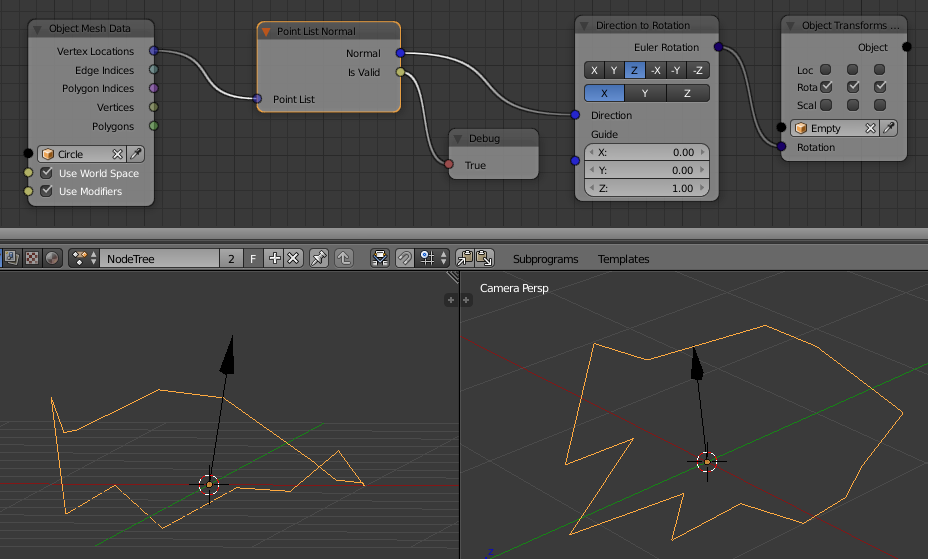

Point List Normal
=================

This node calculates the normal of a set of points (vectors) as if they were forming a polygon.

This is useful for extracting normals of polygons created by nodes and not from a mesh, but also it
can be used to find the normal of a plane out of 3 points instead of the above methods.

The Is Valid output may be used to check if the normal can be calculated. For colinear points and other cases the
normal may not be computable.
A list of min 3 different points is required.

.. note:: The order of the points matters as the flipped normal will be returned
          when the input points are in reversed order.
