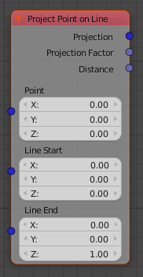

Project Point on Line
=====================

This node provides several information:
 - the location of the closest point on line (projection of the point)
 - the factor [0-1] of this projection in relation to start and end of the line segment
 - the distance between the point and the line

If the point is on line, the distance is 0.0. If the point is inside the segment,
factor is between 0 and 1, while below 0 or above 1 shows on what side is
positioned outside the segment.
