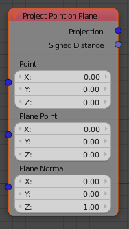

Project Point on Plane
======================

This node provides two useful outputs:
 - the location of the closest point on a plane (projection of the point)
 - the signed distance point to plane. Negative values mean below plane, related to normal
