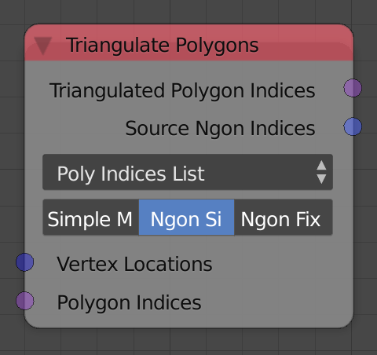
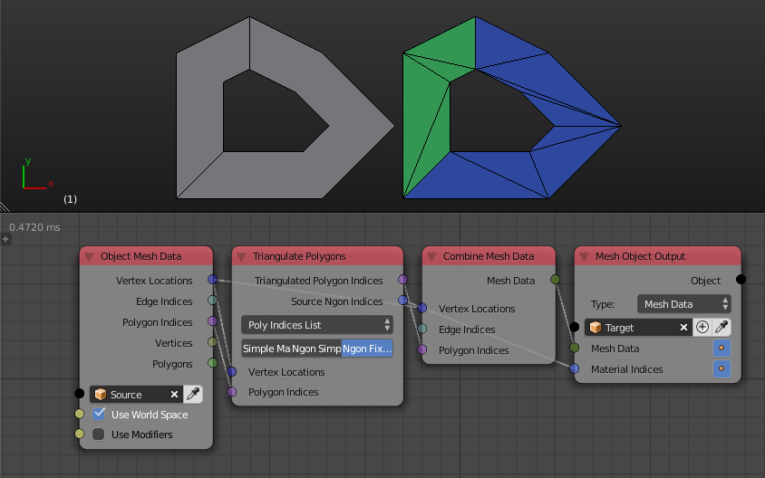
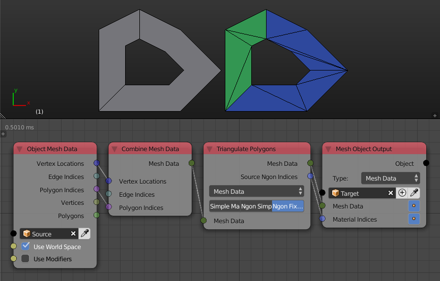
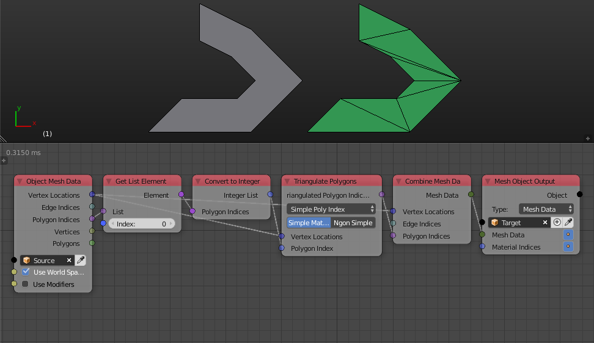
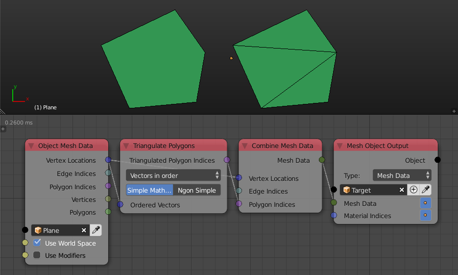

Triangulate Polygons
====================

Description
-----------
This node takes data that represents polygons and return data that represents the triangles of the triangulated version of that input polygons.

Options
-------

The node support multiple options which are different on how polygon data is represented, below is an explanation for inputs and outputs of every option.

Poly Indices List:
^^^^^^^^^^^^^^^^^^

This option takes two inputs that represent some polygons:

- **Vertices Locations** - A vector list that represents the locations of the vertices of the polygons to triangulate.
- **Polygon Indices** - The polygon indices list of the polygons to triangulate.

And it returns:

- **Triangulated Polygon Indices** - The polygon indices of the new polygons, which are triangles resulted from the triangulation of of the input polygons.
- **Source Ngon Indices** - An integer list which contains an integer for every output triangle, that integer is the index of the polygon in which the output triangle was originally part of in the input polygons. For instance, If there was 2 input polygons like the below example, then each of the resulted triangle was part of either one of them, if it was part of the first, then its integer is 0 while it is 1 otherwise. In the example below, we connected the integer list to the material indices of the output mesh which has two materials, the triangles that were part of the first polygon are colored based on the first material while the triangles that were part of the second polygon are colored based on the second material.

Mesh Data:
^^^^^^^^^^

This option takes a mesh data that represents some polygons:

- **Mesh Data** - A mesh data which represent the polygons to triangulate. Edge indices are not required.

And it returns:

- **Mesh Data** - A mesh data that contains the triangulated polygons.
- **Source Ngon Indices** - An integer list which contains an integer for every output triangle, that integer is the index of the polygon in which the output triangle was originally part of in the input polygons. For instance, If there was 2 input polygons like the below example, then each of the resulted triangle was part of either one of them, if it was part of the first, then its integer is 0 while it is 1 otherwise. In the example below, we connected the integer list to the material indices of the output mesh which has two materials, the triangles that were part of the first polygon are colored based on the first material while the triangles that were part of the second polygon are colored based on the second material.

Simply Poly Index:
^^^^^^^^^^^^^^^^^^

This option takes two inputs that represent a single polygon:

- **Vertices Locations** - A vector list that represent the locations of the vertices of the polygon to triangulate.
- **Polygon Index** - An integer list that contain the polygon indices of that polygon.

And it returns:

- **Triangulated Polygon Indices** - A polygon indices list that represent the polygon indices of the triangles.

Vectors In Order:
^^^^^^^^^^^^^^^^^

This options assume that every vertex is connected to the vertex next to it to form a polygon, and so it only takes a single input:

- **Ordered vectors** - A vector list that represent the locations of the vertices, the order matters because every vector will be considered connected to the vector next to it to form a polygon.

And it returns:

- **Triangulated Polygon Indices** - The polygon indices of the new polygons, which are triangles resulted from the triangulation of of the input polygon.

Quality Options
---------------

Each of of the methods described above have multiple algorithm to use for computations, some of them are more accurate than others but also slower:

- **Simple Mathutils Triangulation** - It is the fastest but the least accurate triangulation available, if you tried it and it worked fine, then you should use it for faster execution.
- **Ngon Simple** - It is slower but more accurate than the simple triangulation, but it is not recommended to use with concave polygons, the simple triangulation or Ngon fix may be better in this case.
- **Ngon Fix** - It is the slowest yet the most accurate method available, it solves problems that the Ngon simple have with concave polygon.

Advanced Node Settings
----------------------

- N/A
