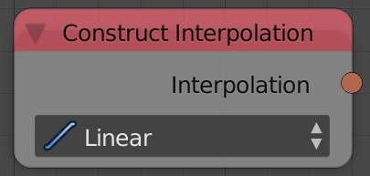
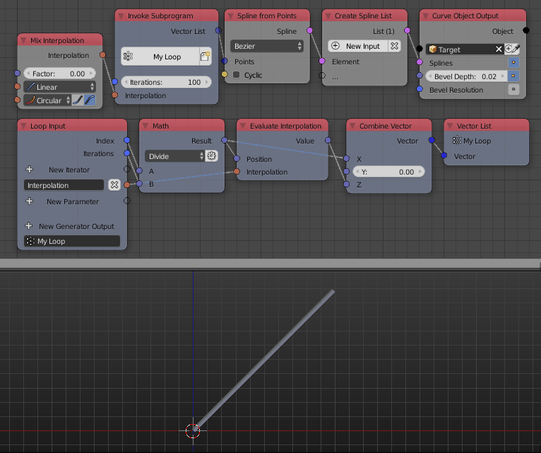

Construct Interpolation
=======================

Description
-----------

This node constructs an interpolation. It construct multiple function types like:

- **Linear**.
- **Sinusoidal** - Sometimes known as the ease in-out function.
- **Power**.
- **Exponential**
- **Circular**.
- **Back**.
- **Bounce**.
- **Elastic**.

Inputs
------

- Based on the selected function.

Outputs
-------

- **Interpolation** - An interpolation.

Advanced Node Settings
----------------------

- N/A

Notes
-----

Ease in option need to be checked for some interpolations like the power and exponential interpolation to work.

Examples of Usage
-----------------

