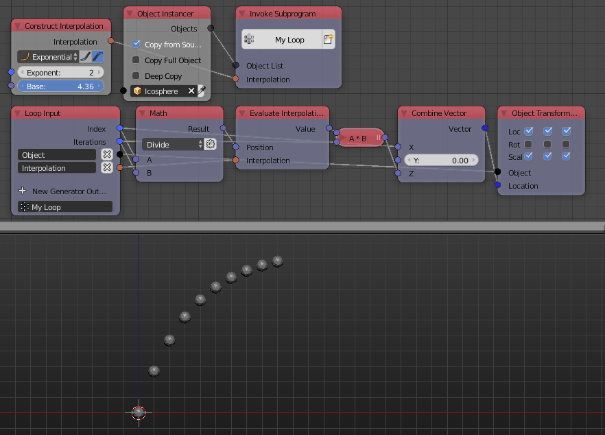

Construct Interpolation
=======================

Description
-----------
This node constructs a function. It has multiple function types like:

- **Linear**.
- **Sinusoidal** - Sometimes known as the ease in-out function.
- **Power**.
- **Exponential**
- **Circular**.
- **Back**.
- **Bounce**.
- **Elastic**.

.. image:: images/construct_interpolation_node.png
   :width: 160pt

Inputs
------

- Based on the selected function.

Outputs
-------

- **Interpolation** - A function.

Advanced Node Settings
----------------------

- N/A

Notes
-----

Ease in option need to be checked for some functions like the power and exponential functions to work.

Examples of Usage
-----------------

