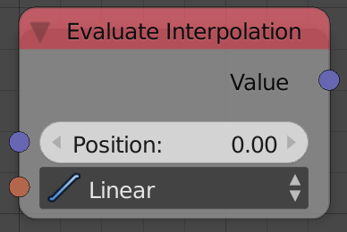
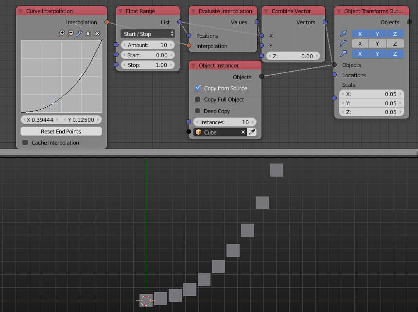

Evaluate Interpolation
======================

Description
-----------

This node evaluates the input Interpolation at the input position.

Inputs
------

- **Position** - The value at which the interpolation is evaluated at.(`x` in `F(x)` where `F` is the input interpolation.)
- **Interpolation** - An interpolation to evaluate.(`F` in `F(x)` where `x` is the input position)

Outputs
-------

- **Value** - The output of the interpolation at the value *Position*.(`F(x)` where `F` is the input interpolation and `x` is the input position)

Advanced Node Settings
----------------------

- N/A

Examples of Usage
-----------------

