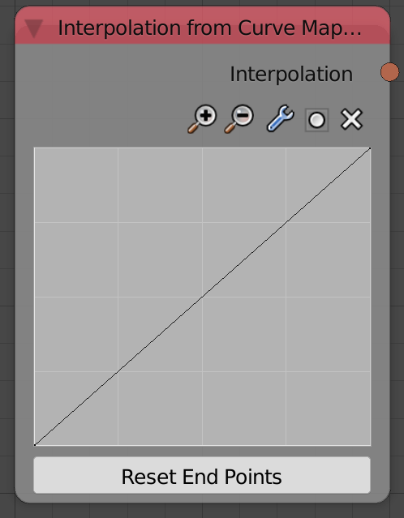
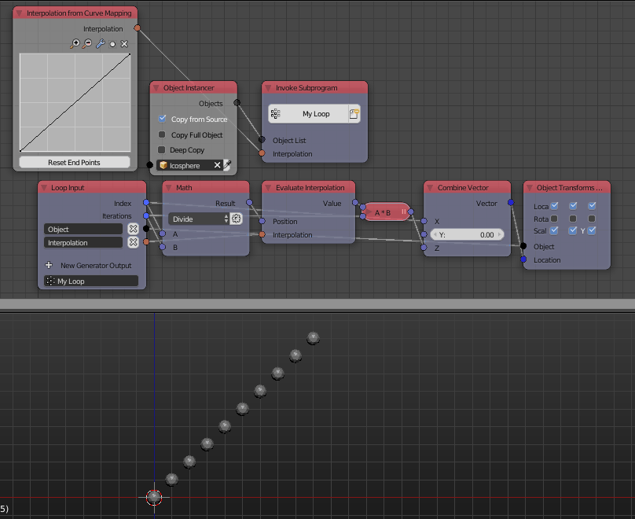

Interpolation From Curve Mapping
================================

Description
-----------
This node takes some points and returns a function that represents a spline interpolation of the input points.

Inputs
------

- Editing the curve work just like blender's interpolation curve.

Outputs
-------

- **Interpolation** - A function that represent a spline interpolation of the input points.

Advanced Node Settings
----------------------

- N/A

Examples of Usage
-----------------

