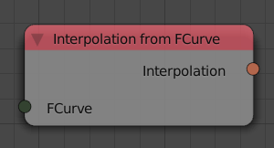

Interpolation From FCurve
=========================

Description
-----------
This node generates a function from a Fcurve---A blender data block that represent animations of transformation channels or other values.

Inputs
------

- **FCurve** - A FCurve.

Outputs
-------

- **Interpolation** - A function that represents the input FCurve.

Advanced Node Settings
----------------------

- N/A
