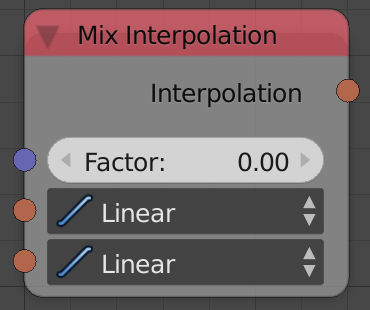

Mix Interpolation
=================

Description
-----------
This node mixes between two interpolations by a defined factor.

If one were to mix two interpolations by a factor `F` and evaluate the output interpolation at the value `V`, He would observe that the result is identical to the result of evaluating both interpolations at `V` and mixing their outputs by the factor `F`.

Inputs
------

- **Factor** - A float that control the amount of each interpolation input to the output, Where 0 means the first interpolation only and 1 means the second interpolation only.

Outputs
-------

- **Interpolation** - The result of mixing the two interpolations by the factor.

Advanced Node Settings
----------------------

- N/A

Examples of Usage
-----------------

.. image:: gifs/mix_interpolation_node_example.gif
