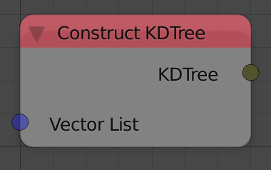

Construct KD Tree
=================

Description
-----------
This node construct a KD Tree from the input vector list.

Demonstration
-------------

KD Trees is a space-partitioning data structure that can be used in multiple spatial searching applications like:

- Find the nearest point to a given point.
- Find points that lie inside a circle of given radius and center.

This data structure is used instead of a traditional nearest neighbor search because it is tremendously faster having a complexity `of O(n)` in the worst case.

Inputs
------

- **Vector List** - A vector list that contain the locations of the points.

Outputs
-------

- **KDTree** - The output KDTree.

Advanced Node Settings
----------------------

- N/A

Examples of Usage
-----------------

.. image:: gifs/construct_kd_tree_node_example.gif
