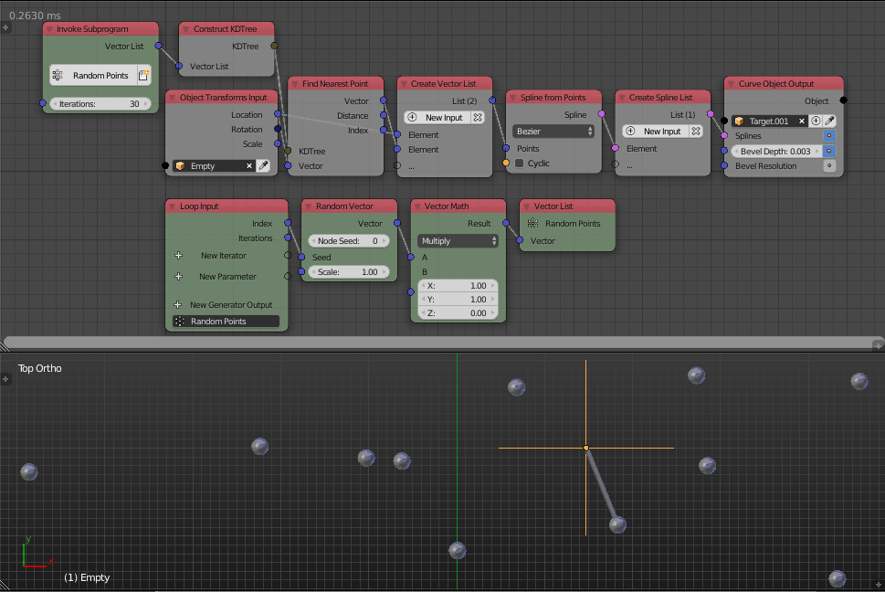

Find Nearest Point
==================

Description
-----------

This node finds the nearest point in the input KD Tree to a given point.

.. image:: images/find_nearest_point_node.png
   :width: 160pt

Inputs
------

- **KD Tree** - A KD tree that contain your points.
- **Vector** - A vector that represent the location of the point in which we want to find its nearest point.

Outputs
-------

- **Vector** - The location of the point that is nearest to the input point.
- **Distance** - The distance between the output point and the input point.
- **Index** - The index of the nearest point to the input point in the list used to construct the KD tree.

Advanced Node Settings
----------------------

- N/A

Examples of Usage
-----------------

