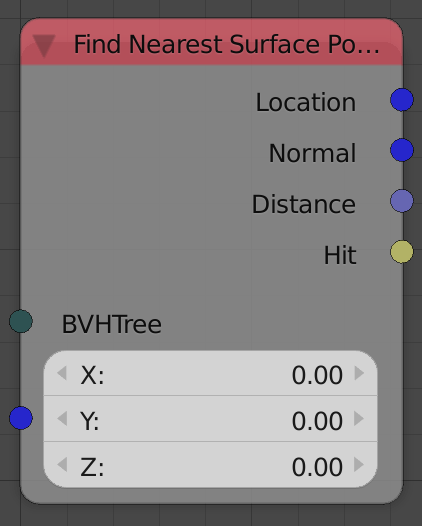
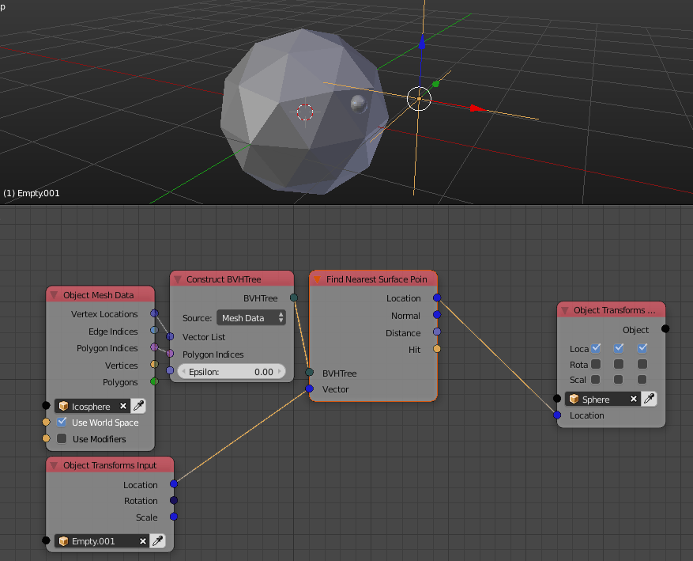

Find Nearest Surface Point
==========================

Description
-----------
This node find the nearest point on the surface of the mesh defined by the BVH to the input point.

Inputs
------

- **BVH** - A BVH tree that represents the mesh you want to find the point on.
- **Vector** - A vector that represents the location of the point to find the point nearest to it.
- **Max Distance** - It is the distance from the input vector at which the node stop searching and return nothing.

Outputs
-------

- **Location** - A vector that represents the location of the nearest point if there was any. (It is a null vector if there wasn't any)
- **Normal** - A unit vector that represents the surface normal at the nearest point if there was any. (It is a null vector if there wasn't any)
- **Distance** - The distance between the input vector and the nearest point if there was any. (It is zero if there wasn't any)
- **Polygon Index** - The index of the polygon that the nearest point belong to if there was any. (It is -1 if there wasn't any)
- **Hit** - A boolean which is True if a nearest point was found and False otherwise.

Advanced Node Settings
----------------------

- N/A

Notes
-----

- The only situation where a point can't be found is when the distance between the input vector and its nearest surface point is larger than the input max distance.

Examples of Usage
-----------------

