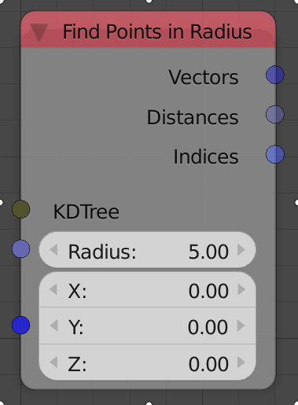
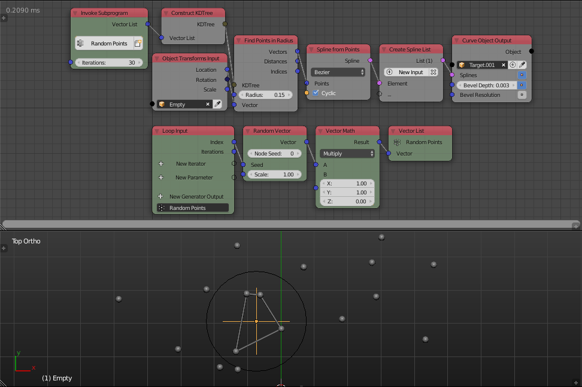

Find Points In Radius
=====================

Description
-----------
This node finds the points that lie inside a circle with a given center and radius in the input KD Tree.

Inputs
------

- **KD Tree** - A KD tree that contain your points.
- **Radius** - The radius of the search circle.
- **Vector** - A vector that represent the center of the search circle.

Outputs
-------

- **Vectors** - The locations of the points that lies inside the circle defined by the input vector and radius.
- **Distances** - The distances between the output points and the input point.
- **Index** - The indices of the nearest points to the input point in the list used to construct the KD tree.

Advanced Node Settings
----------------------

- N/A

Examples of Usage
-----------------

