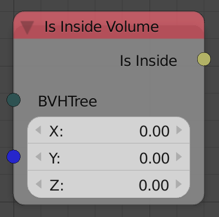
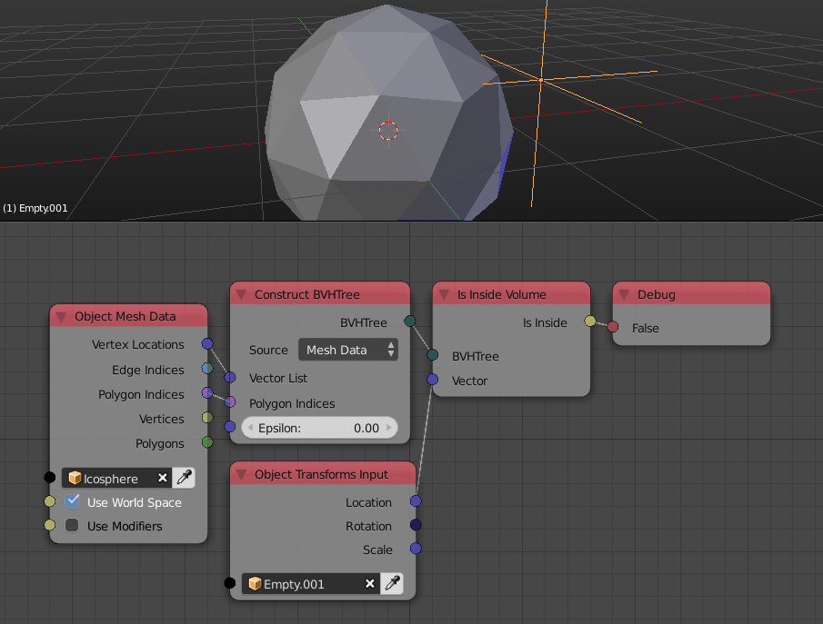

Is Inside Volume
================

Description
-----------

This node check if a point exist inside the mesh defined by the BVH tree.

Inputs
------

- **BVH** - A BVH tree that represents the mesh to check the point against.
- **Vector** - A vector that represents the location of the point to check whether it is inside the mesh or not.

Outputs
-------

- **Is Inside** - A boolean which is True if the input point lies inside the mesh defined by the BVH tree and False otherwise.

Advanced Node Settings
----------------------

- N/A

Notes
-----

- This node works only on manifolds, that is, closed meshes that can be considered a volume. Non-manifolds however are computed stochasticly and unreliable.

Examples of Usage
-----------------

