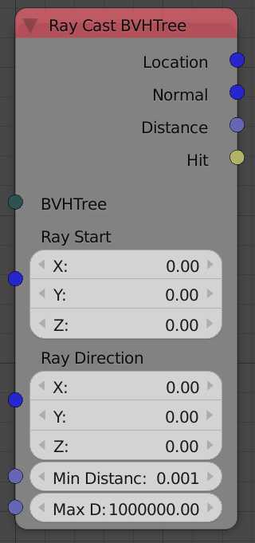
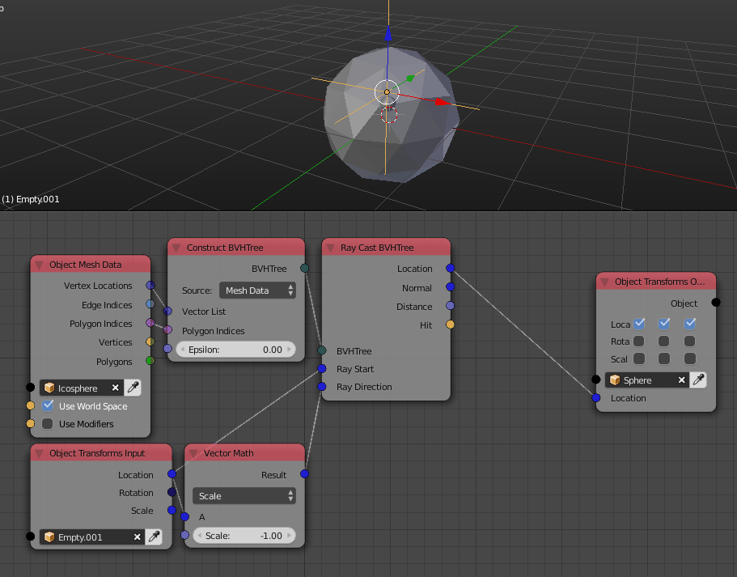

Ray Cast BVH Tree
=================

Description
-----------
This node sends a ray through the scene and gather some information about its intersection with the mesh defined by the BVH tree.

Inputs
------

- **BVH** - A BVH tree that represents the mesh you want to intersect the ray with.
- **Ray Start** - A vector that represents the starting point of the ray.
- **Ray Direction** - A vector that represents the direction of the ray. It doesn't have to be normalized.
- **Min Distance** - It is distance from the ray start at which intersections are starting to be considered.
- **Max Distance** - It is the distance from the ray start at which intersections are not considered anymore.

Outputs
-------

- **Location** - A vector that represents the location of the point of intersection if there was any. (It is a null vector if there was no intersection)
- **Normal** - A unit vector that represents the surface normal at the point of intersection if there was any. (It is a null vector if there was no intersection)
- **Distance** - The distance between the ray start and the point of intersection if there was any. (It is zero if there was no intersection)
- **Polygon Index** - The index of the polygon that the ray intersect if it did. (It is -1 if there was no intersection)
- **Hit** - A boolean which is True if there was an intersection and False otherwise.

Advanced Node Settings
----------------------

- N/A

Notes
-----

- Adjusting minimum and maximum distances won't affect the speed of the ray cast.
- If you want to define the ray by 2 points one of them is the starting point, linear algebra tells you to subtract your second point from your starting point then plug it as the ray direction.

Examples of Usage
-----------------

