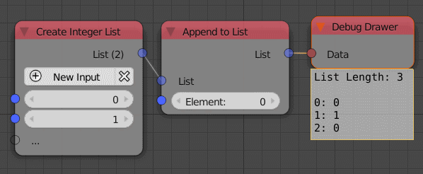

Append To List
==============

Description
-----------
This node can be used to add an extra element to a list of the same data type.
The type of the node changes automatically to whatever the data type you input.

.. image:: images/append_to_list_node.png
   :width: 160pt

Inputs
------

- **List** - An input list.
- **Element** - An element to add to the input list. Indexed as the last element.

Outputs
-------
- **list** - The input list + the extra element.

Advanced Node Settings
-----------------------

- **Change type** - Change the type of the list to another list type.

Examples of Usage
-----------------

