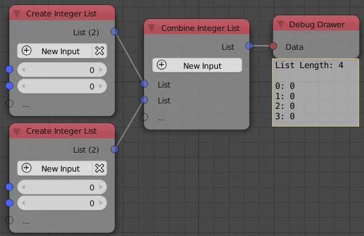

Combine List
============

Description
-----------
This node is used to combine or join an arbitrary number of lists of a specific
data type. A new list can be added with the *New Input* button. A new list can
also be added by plugging it into the transperant socket.The type of the node
change automatically to whatever the data type you input.Means if you input an
integer list, the list type will be integer.

.. image:: images/combine_list_node.png
   :width: 160pt

Inputs
------

- **List** - A list of elements indexed starting from 0.
- **List** - A list of elements indexed starting the last element of the previouse list.
- **List** - ...

Outputs
-------
- **list** - A list that contain all the input lists.

Advanced Node Settings
-----------------------

- **Change type** - Change the type of the list to another list type.

Examples of Usage
-----------------

