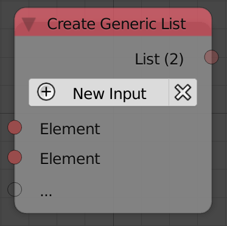
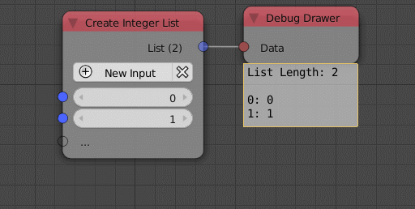

Create List
===========

Description
-----------
This node is used to create an arbitrary list of a specific data type. A new
element can be added with the *New Input* button. A new element can also be
added by plugging it into the transparent socket. The type of the node change
automatically to whatever the data type you input.
This means if you input an integer, the list type will be integer.

Inputs
------

- **Element** - A element at the index 0.
- **Element** - A element at the index 1.
- **Element** - ...

Outputs
-------
- **list** - A list that contain all the input data.

Advanced Node Settings
-----------------------

- **Change type** - Changes the type of the list to another list type.
- **Hide Inputs** - Hides all the inputs in the node.
- **Remove Inputs** - Removes all the inputs.

Caution
-------
A warning pop up when you use the *Remove All* button in the node, while if you
used the the *Remove All* button in the *Advanced Node Settings* the inputs will
be removed without a warning.

Examples of Usage
-----------------

