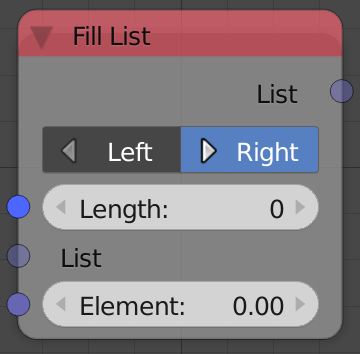
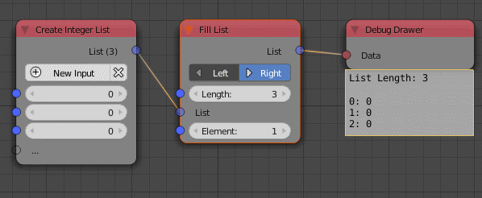

Fill List
=========

Description
-----------

This node takes an input list and change its length by inserting an arbitrary number of the input element.

The **Length** input define the length of the output list, if the input list length was smaller than that number, then the input **Element** will be added till the length matches that of **Length** input. For instance, ``[1,2]`` as input list with **Length** equal to 5 and and **Element** as ``11``, the output list will be ``[1,2,11,11,11]``, notice how ``11`` was added several times to form a list of length ``5``.

If the input list was larger than **Length** input then nothing happens to the list. Moreover, an empty input list would output a list of length input **Length** that is filled with the input **Element**, that's why the node is called Fill.

Options
-------

- **Right** - If chosen, the elements will be added at the end of the list.
- **Left** - If chosen, the elements will be added at the start of the list.

Inputs
------

- **List** - An input list.
- **Length** - The length of the output list.
- **Element** - The element used in filling the empty spaces.

Outputs
-------

- **List** - The filled list.

Advanced Node Settings
----------------------

- **Make Element Copies** - If enabled, the **Element** input will be copied before inserting, this makes sure the elements are independent of the original element used. This option don't work for non objects, so it won't be available if the input list was of float or integer type.

Examples of Usage
-----------------

