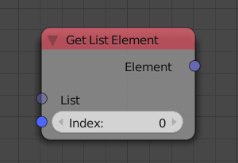
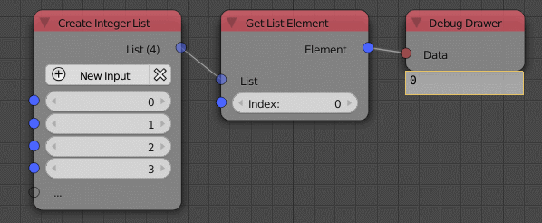

Get List Element
================

Description
-----------
This node return the element at the input index. So if the input index is 1 and
the input list is [1,2,3] then the output will be 2. (Notice that indices start from 0 and not 1)

Inputs
------

- **List** - An input list.
- **Index** - The index of the output element.
- **Fallback**
    This value is an arbitrary value that is output at a certain condition:
    If **Clamp Index** is disabled and the input index is out of the range of
    the input list and If the input list has no elements. If the input list
    is **[1,2,3]** and the index is **3** and **Clamp Index** is disabled then
    the output will be equal to the **Fallback** because the list has 3 elements
    only which means that the greatest index is 2.

Outputs
-------

- **Element** - The element at index *Input Index*

Advanced Node Settings
-----------------------

- **Clamp Index**
    If enabled will return 0 for negative input indicies and the largest index
    if the input index is larger than the largest index.

- **Allow Negative Indicies**
    If enabled and clamp is disables, -1 return the last element, -2 return the second last index ...

- **Make Copy**
    Copy the element before outputting it, this might avoid problems when the element
    is changed later.

- **Change type**
    Change the type of the list to another list type.

Examples of Usage
-----------------

