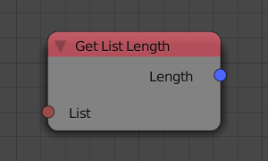
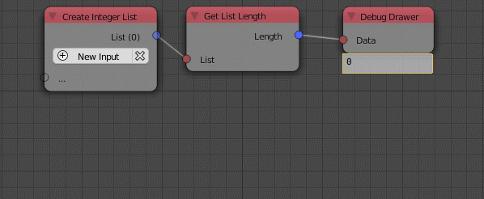

Get List Length
================

Description
-----------
This node return the number of elements in the input list.

Inputs
------
 
- **List** - An input list.

Outputs
-------

- **Length** - The number of elements in the list.

Advanced Node Settings
-----------------------

- N/A

Examples of Usage
-----------------

