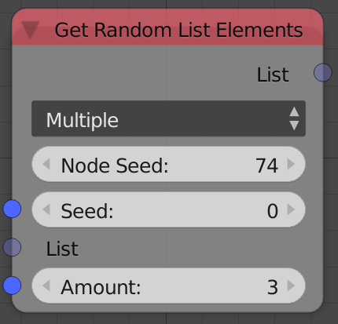
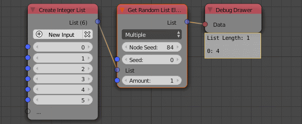

Get Random List Element
=======================

Description
-----------
This node returns single or multiple random list elements.

Inputs
------

- **Seed** - Seed for the random generator, Where different seed return different random elements.
- **List** - The input list.
- **Amount** - The number of random elements in the output list.

Outputs
-------

- **List** - A list that contains random elements from the input list.

Advanced Node Settings
----------------------

- N/A

Note
----

The node has an **extra seed** (*Node Seed*) that can be used to differentiate
between nodes with the same seed, e.g., When using multiple *Get Random List Element*
nodes in a loop while using the index as a seed, you can change the extra seed to get
different results from the other nodes.

Animation Nodes automatically changes the *Node Seed* when you duplicate or add a
new *Get Random List Element* node.

Examples of Usage
-----------------

