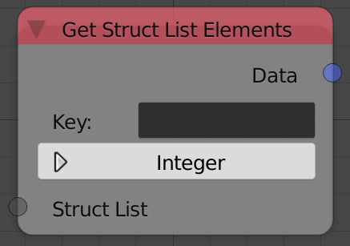
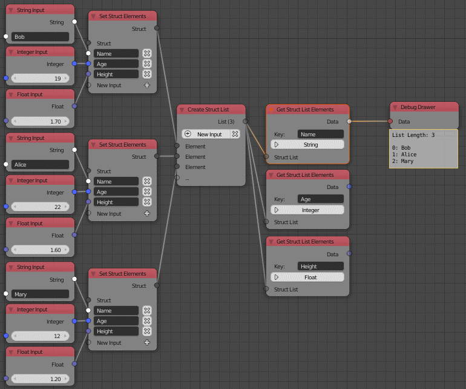

Get Struct List Elements
========================

Description
-----------
This node takes a list of structs and output all the values of a specific common key between them.

So if a list of structs all have a key named Name and you want to output all the
names in that key, you first have to convert the type of the node to be String
because names are strings and then type Name in the field.

Inputs
------

- **Struct List** - A list of structs.

Outputs
-------

- **Data** - A list of values based on the type you choosed.

Advanced Node Settings
----------------------

- N\A

Examples of Usage
-----------------

