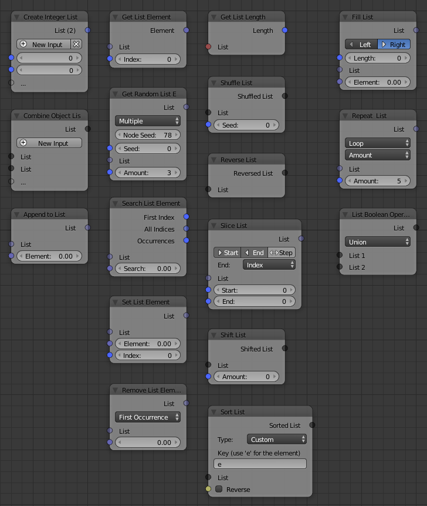

List
====

.. toctree::
    :maxdepth: 1

    Create List <create_list>
    Combine List <combine_list>
    Append to List <append_to_list>

    Get List Length <get_list_length>

    Set List Element <set_list_element>
    Get List Element <get_list_element>
    Remove List Element <remove_list_element>
    Search List Element <search_list_element>

    Fill List <fill_list>
    Repeat List <repeat_list>
    Reverse List <reverse_list>
    Shift List <shift_list>
    Shuffle List <shuffle_list>
    Slice List <slice_list>
    Sort List <sort_list>

    Get Random List Element <get_random_list_element>
    List Boolean Operations <list_boolean_operations>

    Set Struct Elements <set_struct_elements>
    Get Struct Elements <get_struct_elements>
    Get Struct List Elements <get_struct_list_elements>

