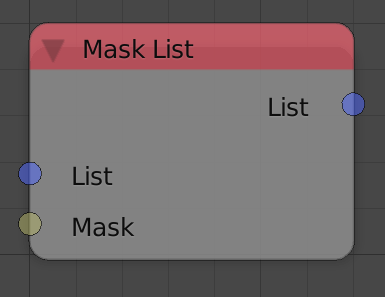
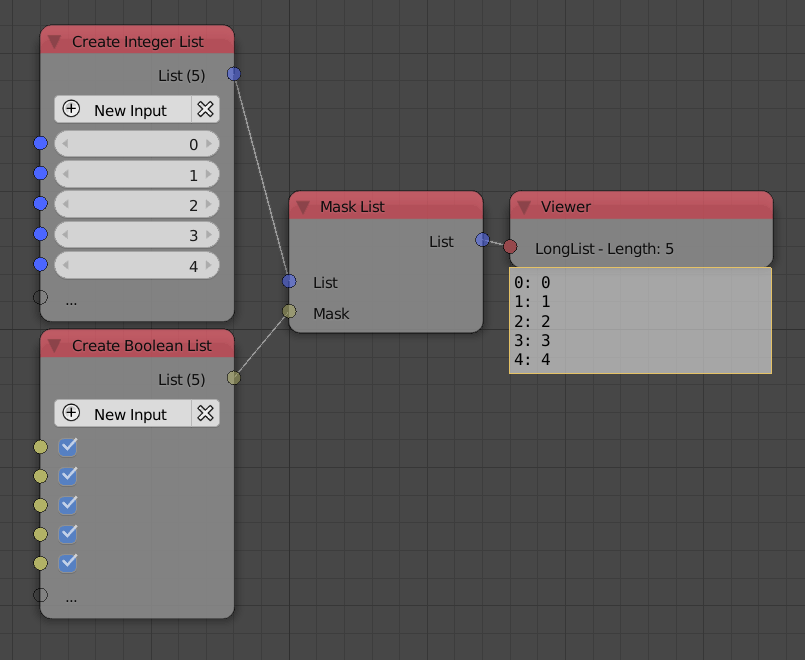

Mask List
=========

Description
-----------

This node can be used to selectively remove list elements based on a boolean list. A boolean list with the same length as the input list has to be provided, for every element in the input list, if the boolean at the same index in the boolean list was False, then this element will not be included in the output list.

Inputs
------

- **List** - An input list.
- **Mask** - A boolean list.

Outputs
-------

- **List** - The output list.

Advanced Node Settings
-----------------------

- N/A

Examples of Usage
-----------------

