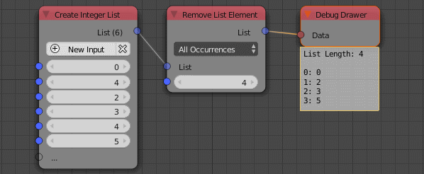

Remove List Element
===================

Description
-----------
This node remove certain list elements based on their index or their values.
The type of the node change automatically to whatever the data type you input.

.. image:: images/remove_list_element_node.png
   :width: 160pt

Options
-------

- **First Occurrence**
    This option remove the input value the at its first apperance only. So if the
    input value is 1 and the input list is ``[1,2,3,1]`` the ouput list will be
    ``[2,3,1]``. Notice hat the last 1 didn't change.

- **All Occurrence**
    This option remove all the input values from the list.
    So for the previouse example the output list will be [2,3].

- **Index**
    This option removes the element at the input index.So for the previouse example
    with input index as 1 then the output will be ``[1,3,1]`` because 2 was at index 1.

Inputs
------

- **List** - An input list.
- **Value/Index** - The index of the element or its value(Based on the selected option).

Outputs
-------

- **List** - The edited list.

Advanced Node Settings
-----------------------

- N/A

Examples of Usage
-----------------

