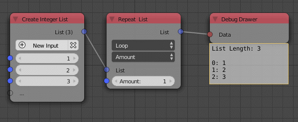

Repeat List
===========

Description
-----------
This node is used to repeat a list a specific number of times.

.. image:: images/repeat_list_node.png
   :width: 160pt

Options
-------

- **Loop**
    This option is the standard repetition pattern.
    Input list ``[1,2,3]`` repeated 2 times will output ``[1,2,3,1,2,3]``.
- **Ping Pong**
    This option is a repeat reverse patten.Input list ``[1,2,3]`` repeated 2 times
    will output ``[1,2,3,3,2,1]``.

- **Amount**
    This option defines the amount of repetition.
- **Length**
    This option defines the length of the output list.
    The amount of repetition is set automatically to fill that length, all the
    elements which exceed that length will be cut off. If the length is 5, the
    output list will be [1,2,3,1,2] Notice that the second 3 was cut because
    it exceeded the defined length.
- **Below Length**
    Just like **Length** this option allow you to define the length but if the
    length was not sufficient to complete a whole repetition, that last repetition
    will be rejected. So if the length is set to 5 the output will be ``[1,2,3]``.
    Notice that the whole second repetition was rejected because it didn't make
    it to the last element.
- **Above Length**
    Just like **Below Length** this option allows you to define the length but if
    the length was sufficient to add at least one element from the second repetition,
    the whole second repetition will be added. So if the length was 5 the output
    will be ``[1,2,3,1,2,3]``. Notice that the second 3 was not supposed to be
    in the list but it was added anyway.

Inputs
------

- **List** - An input list.
- **Length** - The length definiton vary from an option to another.

Outputs
-------

- **List** - The repeated list.

Advanced Node Settings
----------------------

- **Make Element Copies**
    Copy individual elements to avoid problems when the elements are later modified
    in other nodes.

Examples of Usage
-----------------

