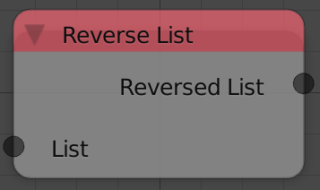
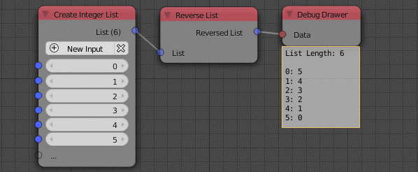

Reverse List
============

Description
-----------
This node flip the order of the elements of the list.The list ``[1,2,3]`` becomes ``[3,2,1]``.

Inputs
------

- **List** - An input list.

Outputs
-------

- **Reversed List** - The flipped list.

Advanced Node Settings
-----------------------

- N/A

Examples of Usage
-----------------

