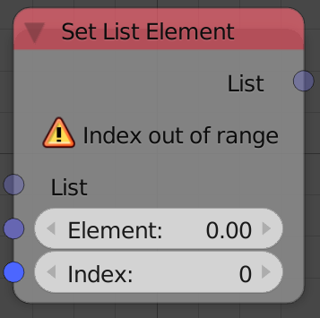
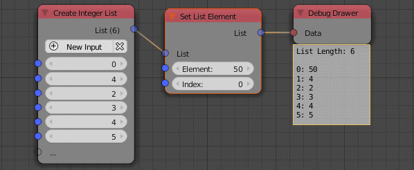

Set List Element
================

Description
-----------

This node replaces the value of the element at the input index by the input value.

Inputs
------

- **List** - An input list.
- **Index** - The index of the element to change.
- **Element** - The new value.

Outputs
-------

- **List** - The edited list.

Advanced Node Settings
-----------------------

- **Clamp Index** - If enabled, it will set the first element for negative input indicies that their absolute is larger than or equal the list length assuming that **Allow Negative Indices** is enabled, if not, any negative indices will change the first element, it will also change the last element if the input index is larger than or equal the length of the list.

- **Allow Negative Indicies** - If enabled, -1 changes the last element, -2 changes the second last index, ...

Examples of Usage
-----------------

