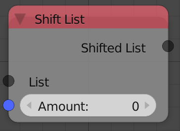
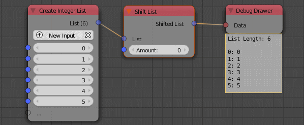

Shift List
==========

Description
-----------

This node shifts the position of elements of the input list by a specific amount. Every element goes to the index ``i+n mod l``, where ``i`` is the element's index, `n` is the amount of shifting and ``l`` is the length of the list. So if the amount is equal to 1 the first elements becomes the second element, the second becomes the third and the last becomes the first.

Inputs
------

- **List** - An input list.
- **Amount** - The amount of shifting.

Outputs
-------

- **Shifted List** - The shifted list.

Advanced Node Settings
-----------------------

- N/A

Examples of Usage
-----------------

