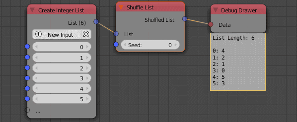

Shuffle List
============

Description
-----------
This node redistribute the elements of the list in a random different order.

.. image:: images/shuffle_list_node.png
   :width: 160pt

Inputs
------
 
- **List** - An input list.
- **Seed** - A seed for the random generator,where different seeds output elements in different orders.

Outputs
-------

- **Shuffled List** - The list after the elements random redistribution.

Advanced Node Settings
-----------------------

- N/A

Examples of Usage
-----------------

