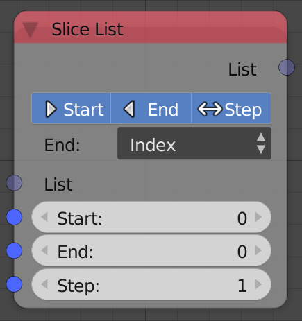
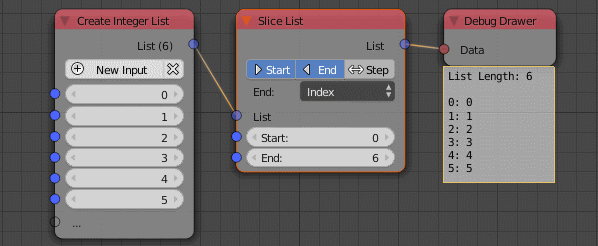

Slice List
==========

Description
-----------

This node outputs only a portion of the input list.

Options
-------

- **Start** - Defines the start index of the output list. So if the input list is ``[1,2,3,4]`` and Start value is 2 then the new list will be ``[3,4]`` that's because the node will reject the elements before that index and output a list that starts from that index. If disabled, start will be considered zero.
- **End** - Defines the ending index of the output list. So assuming the start is 0 and end is 2 the output list in the previous example will be ``[1,2,3]`` that's because the node will reject the elements after that index and output a list that ends by that index.
- **Step** - Defines the step size between each index. So if the step size is equal to 2 then the output list will be ``[1,3]`` notice that the index jumped 2 values to get from 1 to 3 and that what the step size defines.

- **Index** - The end element is defined by its index.
- **Length** - The end element is defined automatically by providing the length of the output list.

Inputs
------

- **List** - An input list.
- **Start** - The starting index of the output length.
- **End/Length** - The ending index or the length of the output list. (Based on the chosen option)
- **Step** - The step size of the output list.

Outputs
-------

- **List** - The sliced list.

Advanced Node Settings
-----------------------

- **Change type** - Change the type of the list to another list type.

Examples of Usage
-----------------

