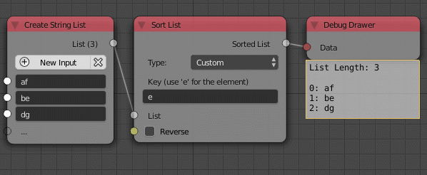

Sort List
=========

Description
-----------
This node sorts a list of a specific data type based on a specific property.
The input list can be of any data type and there is 2 main options you can use for sorting :Custom expression and key list.
However, some data types have more than 2 ways of sorting such as the objects and polygons lists.

.. image:: images/sort_list_node.png
   :width: 160pt

Options
-------

- **Custom** - This option allow you to sort the list based on an input data attribute. So if the list data type is vectors, you can use the expresion "e.x" which will sort the vectors based on their x component (from the smallest x to the largest x). Another example, if the list data type is stings you can use the expression "e[-1]" to sort the strings based on their last characters (starting from A to Z),Notice that -1 here is the index of the character in the string.
- **key List** - This option allows you to sort list using a reference list. The reference list can be either floats or strings. Suppose I want to sort the list **[1,2,3,4]** to be **[3,1,2,4]**, the reference list for such order would be something like **[1,2,0,3]** this reference list gets sorted from zero to infinity and the same movement that happened to sort this list will happen to the original list. So for instance, the number 0 in the reference list is the smallest number and thus it should be the first element so we move it from the third location to the first location. That same movement will happen to the original list, the element at the third location(which is 3) will move to the first location (Notice that this what happened to get [1,2,3,4] to be [3,1,2,4]).The string reference list is exactly the same but it is sorted from A to Z and an altenative reference list in strings for [1,2,0,3] is [b,c,a,d].

- **Name** - This option only appears when the input list is an object data type and it sorts the objects based on their names from A to Z. This is the same as using "e.name" in the custom option.
- **Point Distance** - This option only appears when the input list is an object data type. It sorts the objects based on their distance from an input point. If 2 objects are equidistant from the point, they are sorted clockwise. The option also allow using the ID key initial transforms instead of the object's location.
- **Direction** - This option only appears when the input list is an object or polygon data type. It sorts the objects or polygons based on their distance to a plane centered at the point (0,0,0) and have a direction as the input direction. The option also allows using the ID key initial transforms instead of the object's location.

Inputs
------

- **List** - An input list.
- **Key** - The reference list if key list option is choosen.
- *Reverse* - An option to reverse the order of the output list.

Outputs
-------

- **Sorted List** - The sorted list.

Advanced Node Settings
-----------------------

- **Element** - The variable used to define the elements of the input list in the custom expression option. By default it is "e".

Examples of Usage
-----------------

