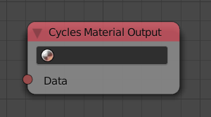
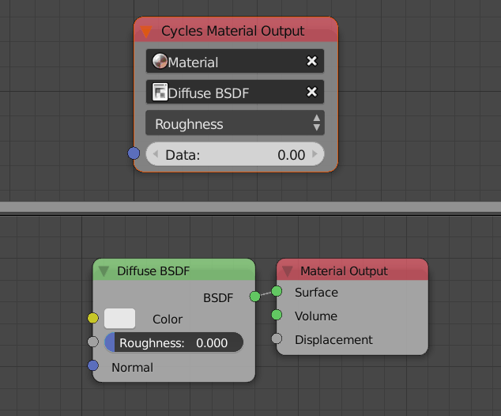

Cycles Material Output
======================

Description
-----------
This node lets you edit cycles node trees from inside Animation Nodes.

First, A material has to be selected in the material field, then, A node has to be selected in the node field, then, A list of all the inputs will be contained in a list, select the required input and its input will be contained in the node to edit.

Inputs
------

- **Data** - Dynamic, based on the selected inputs and nodes.

Outputs
-------

- N/A

Advanced Node Settings
----------------------

- N/A

Examples of Usage
-----------------

